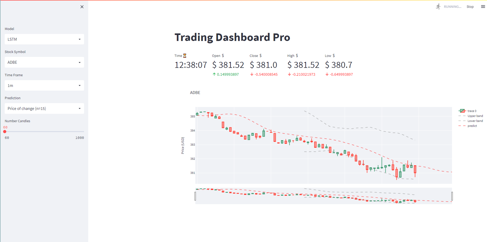
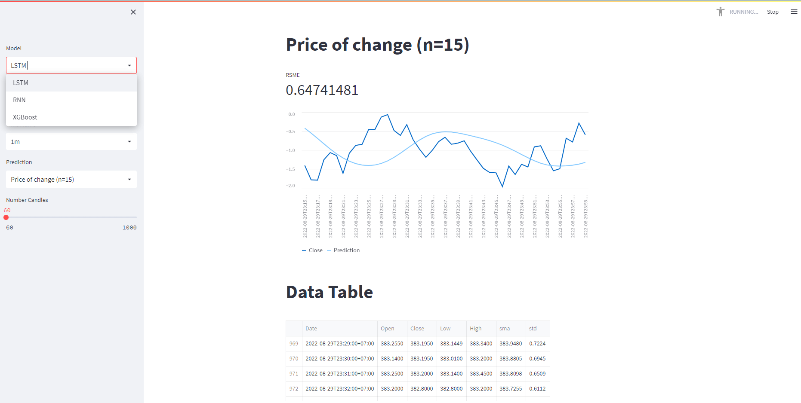

# StockTrain

Stock price prediction using LSTM, RNN and XGBoost

## How to run

The project have 2 parts:

- Back-end: Training models and giving prediction
- Front-end: Drawing charts

###  Requirements

You need to make sure that `python` and `pipenv` are installed on your machine

```shell
> python --version
Python 3.10.6

> pipenv --version
pipenv, version 2022.8.24
```

### Prepare data

Open a terminal in `./back-end` folder and run `pipenv install` to get all dependencies.

```shell
> pipenv install

Installing dependencies from Pipfile.lock (edbfd4)...
Ignoring importlib-metadata: markers 'python_version < "3.10"' don't match your environment
  ================================ 96/96 - 00:02:15
To activate this project's virtualenv, run pipenv shell.
Alternatively, run a command inside the virtualenv with pipenv run.
```


Next, run `.\services\main.py`. This will download a few stock data and train them. Output would look like this

```shell
...
INFO:root:Writing predictions to ../data/predictions/xgboost/ADBE_1y_60m_close.csv
INFO:root:Writing predictions to ../data/predictions/xgboost/ADBE_5y_1d_close.csv
INFO:root:Predicting GOOGL_1y_60m.csv with xgboost model
INFO:root:Predicting GOOGL_5y_1d.csv with xgboost model
INFO:root:Predicting GOOGL_7d_1m.csv with xgboost model
INFO:root:Writing predictions to ../data/predictions/xgboost/GOOGL_1y_60m_close.csv
INFO:root:Writing predictions to ../data/predictions/xgboost/GOOGL_5y_1d_close.csv
INFO:root:Writing predictions to ../data/predictions/xgboost/GOOGL_7d_1m_close.csv
INFO:root:Predicting MSFT_1y_60m.csv with xgboost model
INFO:root:Predicting MSFT_5y_1d.csv with xgboost model
INFO:root:Predicting MSFT_7d_1m.csv with xgboost model
INFO:root:Writing predictions to ../data/predictions/xgboost/MSFT_1y_60m_close.csv
INFO:root:Writing predictions to ../data/predictions/xgboost/MSFT_5y_1d_close.csv
INFO:root:Writing predictions to ../data/predictions/xgboost/MSFT_7d_1m_close.csv
```


### Start Back-end

Run the `./app.py`. API would server at `localhost:5000`

```shell
> pipenv shell
> flask run

 * Serving Flask app 'app.py' (lazy loading)
 * Environment: development
 * Debug mode: off
2022-08-30 12:22:48.478937: W tensorflow/stream_executor/platform/default/dso_loader.cc:64] Could not load dynamic library 'cudart64_110.dll'; dlerror: cudart64_110.dll not found
2022-08-30 12:22:48.479031: I tensorflow/stream_executor/cuda/cudart_stub.cc:29] Ignore above cudart dlerror if you do not have a GPU set up on your machine.
INFO:root:Read 3 companies
INFO:werkzeug: * Running on http://127.0.0.1:5000 (Press CTRL+C to quit)
```

### Start Front-end

Open a terminal at `./front-end`, run `pipenv install` then run

```shell
> streamlit run .\app.py

You can now view your Streamlit app in your browser.

  Local URL: http://localhost:8501
  Network URL: http://192.168.0.102:8501
```

## Result



